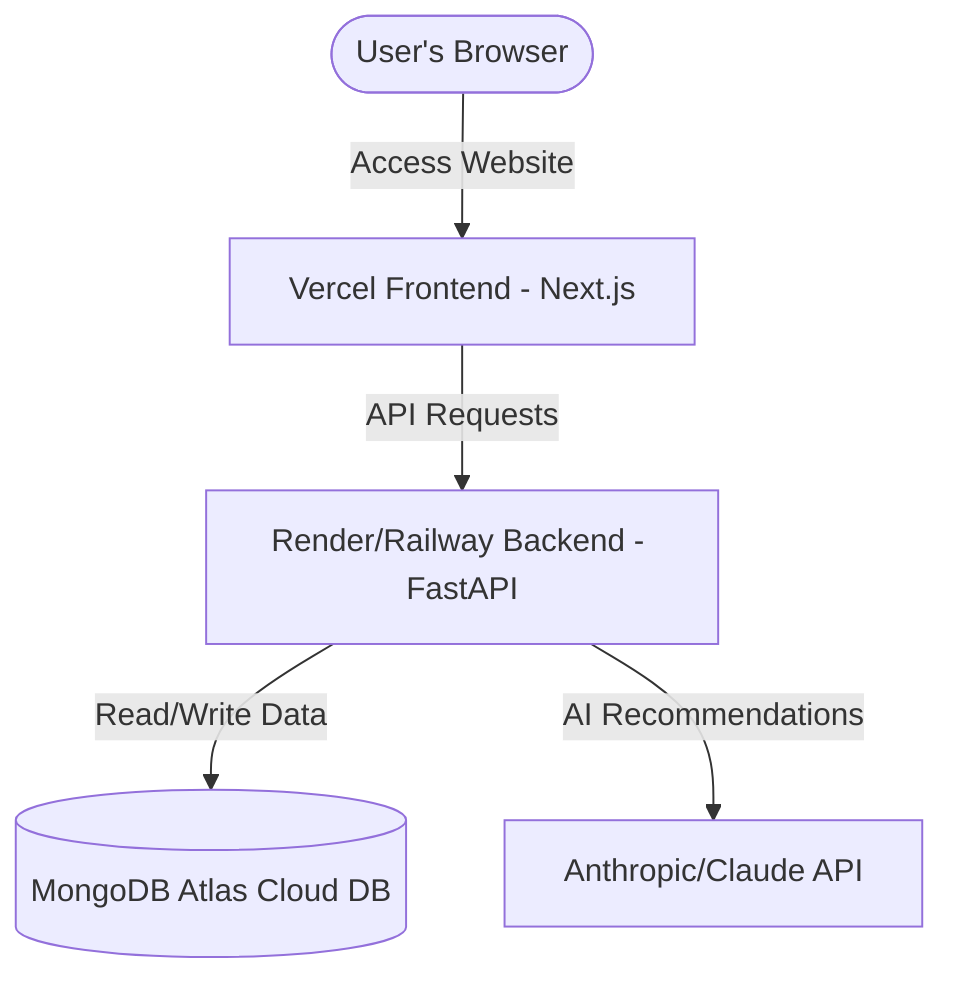

# 🚀 Traveloop Deployment Guide

This guide details how to deploy the **Traveloop** full-stack application to production. 

Because Traveloop is a modern full-stack application, it is split into two specialized services:
1. **Frontend (Next.js)** — Deployed to **Vercel** (Global CDN, fast page loads, optimized for Next.js).
2. **Backend (FastAPI)** — Deployed to **Render**, **Railway**, or **Fly.io** (Ideal for persistent Python web servers and long-running AI/LLM requests).
3. **Database (MongoDB)** — Deployed to **MongoDB Atlas** (Free tier, fully-managed, highly available cloud MongoDB).

---

> [!WARNING]
> **Why we do not run the FastAPI backend directly on Vercel:**
> While Vercel supports Python Serverless Functions, Vercel's Hobby (Free) tier has a strict **10-second execution timeout** per request. Since Traveloop leverages advanced AI agents (LangChain/Claude) to generate detailed itineraries and predict budgets, these AI calls can frequently take longer than 10 seconds. On Vercel serverless, these requests would trigger **504 Gateway Timeouts** and crash the AI itinerary feature. Deploying the backend to a dedicated platform like Render allows requests to run up to 5 minutes, ensuring reliable AI completions.

---

## 🗺️ Deployment Architecture Overview



---

## 🛠️ Step 1: Set Up MongoDB Atlas (Cloud Database)

Since your local backend uses `mongodb://localhost:27017`, you need a cloud-hosted MongoDB instance in production so your deployed backend can persist travel data.

1. **Sign Up:** Create a free account at [MongoDB Atlas](https://www.mongodb.com/cloud/atlas/register).
2. **Create a Cluster:** Build a new database cluster. Choose the **M0 Free Tier** (Shared RAM/Storage, 0$/month) in your preferred region.
3. **Configure Access:**
   - Under **Security > Network Access**, click **Add IP Address** and choose **Allow Access from Anywhere** (`0.0.0.0/0`) so that your Render backend can connect.
   - Under **Security > Database Access**, click **Add New Database User**. Choose a username and a strong password. Save these credentials securely.
4. **Get Connection String:**
   - In the database dashboard, click **Connect > Drivers**.
   - Copy the connection string. It will look like this:
     ```text
     mongodb+srv://<username>:<password>@cluster0.xxxxxx.mongodb.net/?retryWrites=true&w=majority
     ```
   - Replace `<username>` and `<password>` with your database user credentials.

---

## 🐍 Step 2: Deploy the FastAPI Backend (Render)

[Render](https://render.com) is the easiest and most reliable free platform to host Python FastAPI servers.

### Method A: Using Render's Web UI

1. **Push to GitHub:** Ensure your code is pushed to your GitHub repository (e.g., `https://github.com/rushipatil1808/Traveloop`).
2. **Sign Up:** Create a free account on [Render](https://render.com) and link your GitHub account.
3. **Create a New Web Service:**
   - Click **New + > Web Service**.
   - Connect your GitHub repository.
4. **Configure the Service Settings:**
   - **Name:** `traveloop-api`
   - **Region:** Choose the region closest to you or your users.
   - **Branch:** `main` (or your active branch)
   - **Root Directory:** `backend` (⚠️ *Very Important: Tells Render to build from the backend folder*)
   - **Runtime:** `Python`
   - **Build Command:** `pip install -r requirements.txt`
   - **Start Command:** `python -m uvicorn app.main:app --host 0.0.0.0 --port $PORT`
   - **Instance Type:** `Free`
5. **Add Environment Variables:**
   Click **Advanced > Add Environment Variable** and configure the following keys:

   | Key | Value | Description |
   |-----|-------|-------------|
   | `MONGODB_URI` | `mongodb+srv://...` *(from Step 1)* | Your cloud MongoDB Atlas connection URI |
   | `MONGODB_DATABASE` | `traveloop` | Database name |
   | `SECRET_KEY` | *(A long random string)* | Used to sign JWT auth tokens |
   | `ALGORITHM` | `HS256` | JWT signing algorithm |
   | `BACKEND_CORS_ORIGINS` | `["https://your-frontend-domain.vercel.app"]` | **⚠️ Change this to your Vercel URL once deployed** |
   | `AI_PROVIDER` | `anthropic` *(or `openai`)* | The LLM engine to use |
   | `ANTHROPIC_API_KEY` | `sk-ant-...` | Your Anthropic/Claude API token |

6. **Deploy:** Click **Create Web Service**. Render will install Python, install requirements, and boot up your FastAPI application. Copy your live API URL (e.g., `https://traveloop-api.onrender.com`).

---

## ⚡ Step 3: Deploy the Frontend (Vercel)

Vercel is the native platform for Next.js and builds your frontend assets into an ultra-fast global application.

1. **Sign Up:** Create a free account at [Vercel](https://vercel.com) using your GitHub account.
2. **Import Repository:**
   - Click **Add New > Project**.
   - Select your `Traveloop` GitHub repository.
3. **Configure Project Settings:**
   - **Framework Preset:** `Next.js` (automatically detected)
   - **Root Directory:** Edit this and select **`frontend`** (⚠️ *Crucial: Ensures Vercel only builds the frontend directory*).
   - **Build & Development Settings:** Leave as defaults.
4. **Configure Environment Variables:**
   Expand the **Environment Variables** section and add:

   | Key | Value | Description |
   |-----|-------|-------------|
   | `NEXT_PUBLIC_API_BASE_URL` | `https://your-backend-api-url.onrender.com` | **The URL of your deployed Render backend (from Step 2)** |
   | `NEXT_PUBLIC_API_VERSION` | `/api/v1` | Root API route version |
   | `NEXT_PUBLIC_APP_NAME` | `Traveloop` | UI Application Name |
   | `NEXT_PUBLIC_APP_DESCRIPTION` | `AI-Powered Travel Planning Platform` | SEO Description |

5. **Deploy:** Click **Deploy**. Vercel will install dependencies, build the Next.js static pages, and deploy your site to a live `.vercel.app` domain.

---

## 🔄 Step 4: Close the CORS Loop

Once Vercel assigns you a live frontend URL (e.g., `https://traveloop-xyz.vercel.app`):
1. Go back to your **Render Dashboard** for the `traveloop-api` web service.
2. Navigate to **Settings > Environment Variables**.
3. Update `BACKEND_CORS_ORIGINS` to target your live frontend:
   ```env
   BACKEND_CORS_ORIGINS=["https://traveloop-xyz.vercel.app"]
   ```
4. Save the changes. Render will automatically redeploy the backend with the new CORS permissions.

---

## 🧪 Post-Deployment Verification Checklist

Once both services are successfully deployed, perform the following checks:

1. **Health Check:** Open `https://your-backend-api-url.onrender.com/health` in your browser. It should return `{"status": "healthy"}`.
2. **Swagger Docs:** Open `https://your-backend-api-url.onrender.com/docs` to verify that your FastAPI Swagger documentation is loaded.
3. **Account Creation:** Open your live Vercel frontend URL, navigate to `/auth`, and create a new account. Verify that the user details are successfully written to MongoDB Atlas.
4. **AI Generation:** Create a new trip itinerary. Verify that the AI planner generates destinations, activities, and budget cards successfully (confirming LLM integrations work correctly over HTTPS).
