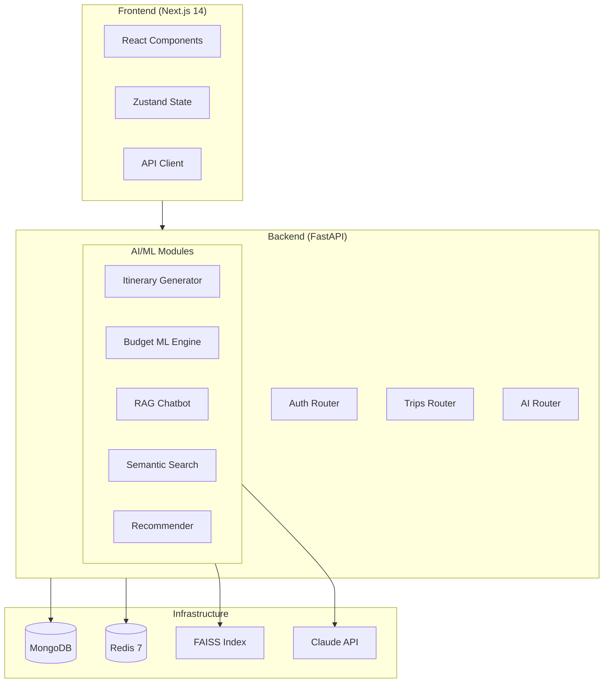

# 🌍 Traveloop — AI-Powered Travel Planning Platform

> **Odoo Exceller Buildathon** | Team **Antigravity** 🚀

[](https://fastapi.tiangolo.com)
[](https://nextjs.org)
[](https://www.mongodb.com)
[](https://anthropic.com)
[](https://langchain.com)

---

Traveloop is a **production-grade, AI-powered travel planning platform** inspired by Canva's drag-and-drop UX, built specifically for creating beautiful, intelligent travel itineraries.

## ✨ Features

| Feature | Technology | Description |
|---------|-----------|-------------|
| 🤖 AI Itinerary Generator | LangChain + Claude/GPT-4o | Day-wise trip plans with time slots, costs, transport |
| 💰 ML Budget Predictor | Random Forest + Gradient Boosting | Cost forecasting with confidence intervals |
| 💬 RAG Travel Chatbot | FAISS + Sentence Transformers | Conversational assistant with knowledge retrieval |
| 🔍 Semantic City Search | FAISS + all-MiniLM-L6-v2 | NLP natural language destination search |
| ⭐ ML Recommendations | Content-based + Collaborative | Personalized destination recommendations |
| 🗺️ Itinerary Builder | React DnD + Framer Motion | Canva-like drag-and-drop trip planning |
| 📊 Budget Visualization | Recharts | Donut charts, bar charts, cost breakdowns |
| 🔐 JWT Authentication | bcrypt + refresh tokens | Secure auth with 15min access / 7-day refresh |

## 🏗️ Architecture



## 🚀 Quick Start

```bash
# 1. Clone
git clone https://github.com/antigravity/traveloop.git
cd traveloop

# 2. Configure environment
cp .env.example .env
# Edit .env and add your ANTHROPIC_API_KEY or OPENAI_API_KEY

# 3. Launch everything
docker-compose up -d
```

**Access:**
- 🌐 Frontend: http://localhost:3000
- 📖 API Docs: http://localhost:8000/docs
- 🔄 ReDoc: http://localhost:8000/redoc

## 📁 Project Structure

```
traveloop/
├── frontend/
│   ├── app/
│   │   ├── auth/             # Login + Signup
│   │   ├── (app)/
│   │   │   ├── dashboard/    # Home with stats + recommendations
│   │   │   ├── trips/        # Trip list, create, detail
│   │   │   ├── chat/         # AI Travel Assistant
│   │   │   ├── search/       # Semantic destination search
│   │   │   └── profile/      # User settings
│   │   └── globals.css       # Design system (glassmorphism)
│   └── tailwind.config.ts    # Brand tokens
│
├── backend/
│   ├── app/
│   │   ├── api/              # FastAPI routers
│   │   │   ├── auth.py       # JWT auth endpoints
│   │   │   ├── trips.py      # CRUD + drag-drop reorder
│   │   │   ├── ai.py         # All 5 AI endpoints
│   │   │   ├── budget.py     # Budget management
│   │   │   ├── search.py     # City/activity search
│   │   │   └── user.py       # Profile management
│   │   ├── database.py       # MongoDB connection + collections
│   │   ├── schemas/          # Pydantic v2 validation
│   │   ├── ai/               # AI/ML modules
│   │   │   ├── itinerary_generator.py  # Module 1: LangChain
│   │   │   ├── budget_predictor.py     # Module 2: scikit-learn
│   │   │   ├── chatbot.py              # Module 3: RAG
│   │   │   └── search_recommender.py  # Module 4+5: FAISS + hybrid rec
│   │   └── core/             # Config, security, database, deps
│   └── init_db.py            # MongoDB index setup
│
├── docker-compose.yml
├── .env.example
└── docs/                     # API docs, ER diagram
```

## 🤖 AI/ML Module Details

### Module 1 — AI Itinerary Generator
```python
# LangChain chain: PromptTemplate → Claude/GPT-4o → JsonOutputParser → Pydantic
chain = prompt | llm | parser
itinerary = await chain.ainvoke(request_params)
```
- Few-shot prompting with structured JSON output
- Temperature 0.7 for creative plans
- Output: Day-wise activities, time slots, costs, transport

### Module 2 — ML Budget Predictor
```python
# Ensemble: 60% Random Forest + 40% Gradient Boosting
prediction = rf_pred * 0.6 + gb_pred * 0.4
confidence = [prediction * 0.85, prediction * 1.15]
```
- Trained on 2,000 synthetic travel records
- Features: city, style, accommodation type, days, group size, month
- Output: Category breakdown + confidence interval

### Module 3 — RAG Chatbot
```
Query → Sentence Transformer embed → FAISS search → Retrieved docs → LLM → Reply
```
- Knowledge base: 12+ travel guides ingested into FAISS
- Window memory: last 10 conversation turns
- Fallback: LLM-only mode if FAISS unavailable

### Module 4 — Semantic City Search
```python
# all-MiniLM-L6-v2 embeddings + FAISS IndexFlatIP (cosine similarity)
scores, indices = faiss_index.search(query_embedding, top_k=10)
```

### Module 5 — ML Recommendation Engine
```python
# Content-based: city tags × user interests + popularity weighting
score = tag_match_score + city.popularity * 0.5
```

## 📊 Database Schema (10 Tables)

```mermaid
erDiagram
    users ||--o{ trips : owns
    users ||--o{ chatbot_history : generates
    users ||--o{ recommendations : receives
    trips ||--o{ trip_stops : contains
    trips ||--|| budgets : has
    trips ||--o{ notes : has
    trips ||--o{ checklist_items : has
    trip_stops ||--o{ activities : contains
    trip_stops ||--o{ notes : has
    cities ||--o{ recommendations : referenced
    cities ||--o{ trip_stops : referenced
    
    users {
        uuid id PK
        varchar email UK
        varchar password_hash
        varchar full_name
        boolean is_active
    }
    trips {
        uuid id PK
        uuid user_id FK
        varchar name
        date start_date
        date end_date
        varchar travel_style
        decimal total_budget
        uuid share_token UK
        boolean is_public
    }
    trip_stops {
        uuid id PK
        uuid trip_id FK
        varchar city_name
        date arrival_date
        integer order_index
    }
    activities {
        uuid id PK
        uuid stop_id FK
        varchar name
        time scheduled_time
        decimal estimated_cost
        boolean is_completed
    }
    cities {
        uuid id PK
        varchar name
        varchar country
        decimal avg_daily_cost
        float popularity_score
        text[] tags
    }
    budgets {
        uuid id PK
        uuid trip_id FK UK
        decimal accommodation_budget
        decimal ml_predicted_total
        decimal ml_confidence_low
        decimal ml_confidence_high
    }
```

## 🔐 API Reference

**Base URL**: `http://localhost:8000/api/v1`

| Method | Endpoint | Description |
|--------|----------|-------------|
| POST | `/auth/register` | User registration |
| POST | `/auth/login` | Get JWT token pair |
| POST | `/auth/refresh` | Refresh access token |
| GET | `/trips/` | List user trips |
| POST | `/trips/` | Create trip |
| GET | `/trips/{id}` | Trip detail + itinerary |
| POST | `/trips/{id}/reorder` | Drag-drop reorder stops |
| POST | `/ai/generate-itinerary` | 🤖 AI trip generation |
| POST | `/ai/predict-budget` | 💰 ML budget prediction |
| POST | `/ai/chat` | 💬 RAG chatbot |
| POST | `/ai/search` | 🔍 Semantic search |
| GET | `/ai/recommendations/{user_id}` | ⭐ ML recommendations |
| GET | `/health` | Health check |

Full interactive docs at `/docs` (Swagger UI).

## 🛠️ Development Setup

### Backend (FastAPI)
```bash
cd backend
pip install -r requirements.txt
cp ../.env.example .env  # add your API keys
python init_db.py        # initialize MongoDB indexes
uvicorn app.main:app --reload --port 8000
```

### Frontend (Next.js)
```bash
cd frontend
npm install
npm run dev  # http://localhost:3000
```

## 🧪 Testing

```bash
# Backend
cd backend
pytest tests/ -v --cov=app --cov-report=term-missing

# Frontend
cd frontend
npm test
```

## 📦 Production Checklist

- [x] `.env.example` with all variables documented
- [x] Alembic migrations (run on startup)
- [x] JWT access (15min) + refresh (7d) tokens
- [x] Rate limiting on auth routes (slowapi)
- [x] CORS configured per environment
- [x] Structured logging (structlog)
- [x] Health check endpoint `/health`
- [x] Docker multi-stage builds
- [x] Nginx reverse proxy
- [ ] Sentry DSN configured
- [ ] Redis cache headers on AI endpoints
- [ ] SSL/TLS via Let's Encrypt

## 👥 Team Antigravity

Built with ❤️ for the **Odoo Exceller Buildathon 2026**

| Role | Name |
|------|------|
| AI/ML Engineer | Team Antigravity |
| Full-Stack Dev | Team Antigravity |
| UI/UX Design | Team Antigravity |

---

*"Make trip planning as exciting as the trip itself"* ✈️
